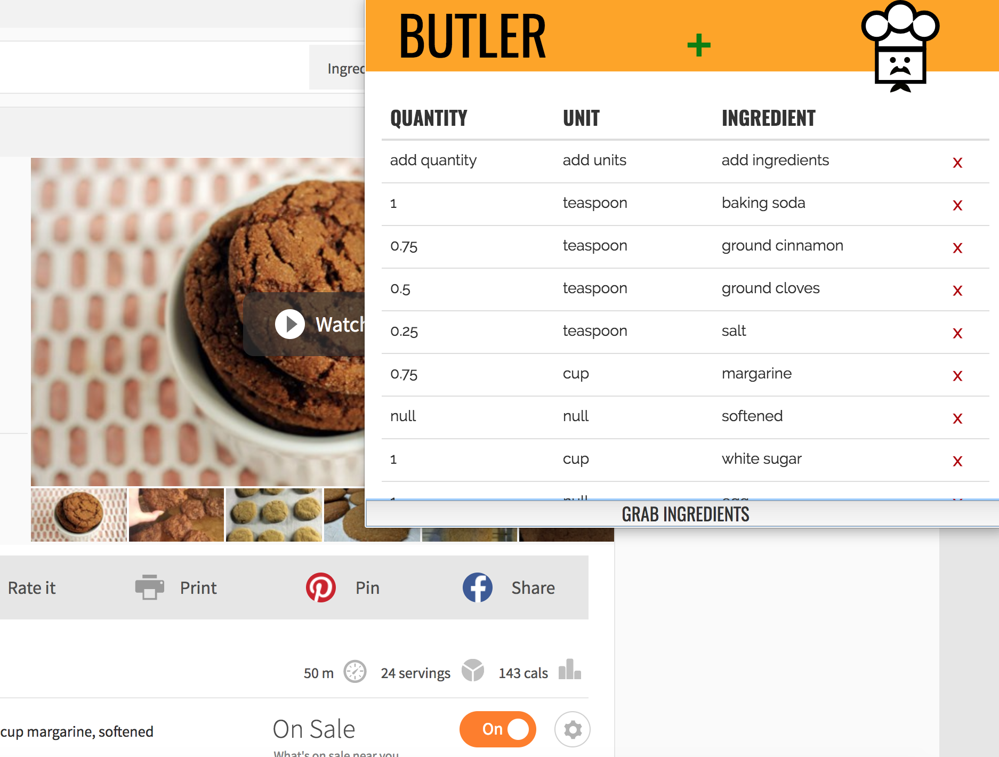

# ButlerApp
Finish and order your groceries with a few clicks!

### Contributors
Jonathan Fermin  
Josh Fermin  
Ian Fawaz  
Chris Chang  
Richard Li  

## Pitch
[Pitch Deck](https://docs.google.com/presentation/d/1oPtpFimSSBVMaGy5ftRDz7ZkC8TUZFRyG5sHph614Xc/edit?usp=sharing)

Getting into cooking is hard enough as it is. Grocery shopping is time consuming. Meal planning requires writing a long list that you take with you to the grocery store.
What if you could click the recipe you were browsing on Bon Appetit, and order it to your house in a couple clicks?
Or what if you could simply choose a meal plan and let BUTLER handle food for your week?

## Description
A chrome extension that parses the webpage, adds ingredients to a cart, and sends those ingredients through SMS  
The goal with this application is to reduce time shopping for groceries and offer alternatives to products like Blue Apron and Hello Fresh

# For Contributors
[Resources for Contributors](https://docs.google.com/document/d/1pGthwhb2tpnO3fkfjI2ebDyEYntzosrxdalqrolCI2U/edit?usp=sharing)

## Minimum Viable Product:
- Web Page Parser for Ingredients list - converts to JSON
- JavaScript SMS sender
- Add/Remove ingredients UI
- Chrome Extension
- Web Page to insert multiple lists of ingredients and output total list

## Ultimate Future Product:
- Amazon Fresh/Instacart Integration
- Meal Plan Calendar
- OCR - input recipe from image

